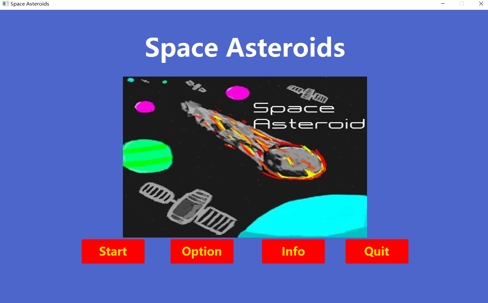
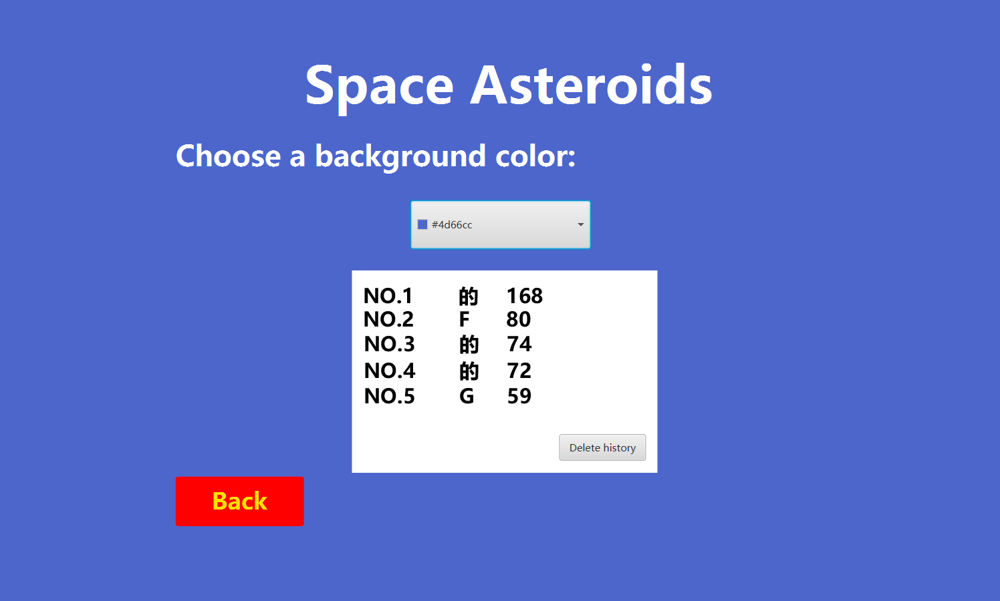
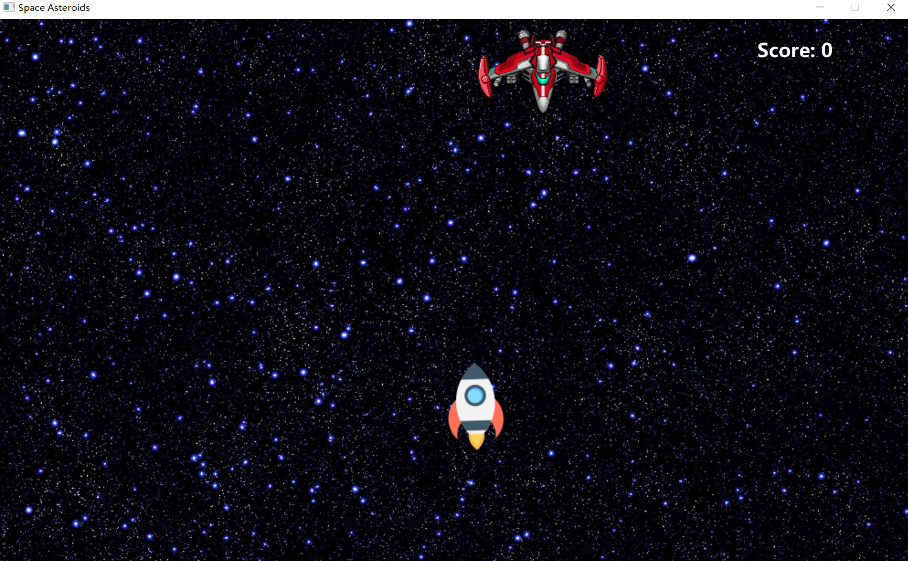
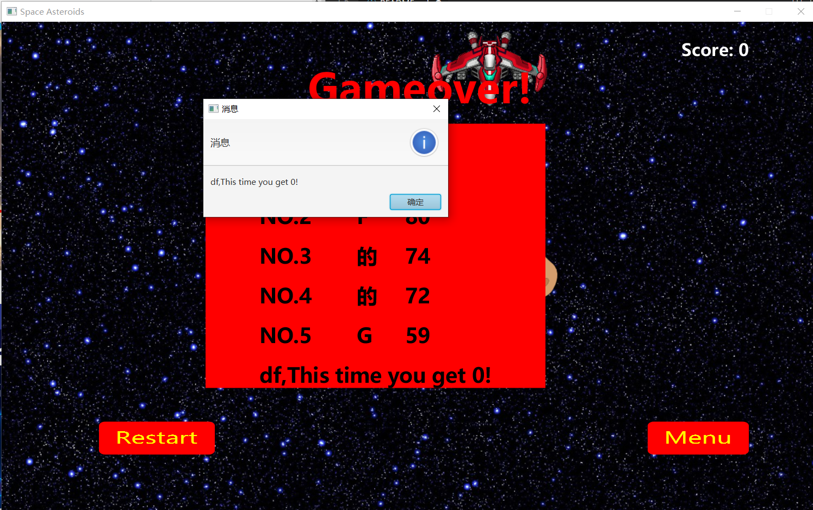

# AE2DMS-CW-Good2Go
# Contributors
### Module Convenor
- Lee Boon Giin (Bryan)
- Heng Yu
### Team Members
- Shujun Jiang ssysj1 20320552
- Luhui Zhou biylz17 20319917

## Development environment
This game is a computer game, the development language is java, jdk 16, testing environment for Windows system.

## Design pattern
- Singleton pattern: we use it to create a boss.This class provides a way to access its unique object, directly, without the need to instantiate an object of that class.
- Strategy pattern: we use it to create asteroid class. These class have different speed. we create speedBehavior for every asteriod to choose their own speed.
- Factory Pattern: we use it to create imgs and sounds.we define an interface to create an object, and let its subclass decide which factory class to instantiate; the factory pattern delays its creation until the subclass does.
- Template method pattern: we use it to create props.An abstract class props publicly defines a way/template to execute its methods. Its subclasses fireprops override method implementations as needed and calls will be made in the way defined in the abstract class props.
- Memento Pattern: we use it to store color and data.To hold a state of an object so that the object can be restored at the appropriate time.

## Code modification
- Maven has been modified so that the project can receive fxml, properties and other types of files. 
- Added jdbc dependencies for using Sqlite and related dependencies for using testfx.
- Refactored the original game script to conform to the MVC pattern. For each stage, there is an FXML and the appropriate controller to work with.
- I/O was added to override the FXML file to permanently change the background color. We use Memento Pattern to temporarily store the color change. Then read the color from memento and setStyle to complete the color change.

## Additional Game Features
- Display the total high score (history) list after the game ends.
- Change to make different units have different health.
- Add shoot, explode, pick up sound effects.
- Add Boss on the scene which has 5 lives. destroy it will pop out a property.
- Add property. Once player collide with it. player can press one space to shoot twice or thrice.
- Add clear button, user can clear the top rank history.
- Add esc button, user can press esc to pause the game, deciding back to menu or continue to play.

## About Test
- The test part is mainly designed for program testing, logic testing and unit testing. "assertEquals" is used to make some Assertions, determining whether material acquisition, computational logic, and game factors all work as expected. 
- For the first Menu stage, we also tested whether the program would start properly.
- Encountered problems testing the FXML Controller and tested the controller using testfx. After adding Maven correctly, our tests still won't run unless we remove Module-info.java. We tried to add more "requires" to the file that testfx relies on, but it didn't work. (We kept two scripts for the test controller in the project, but they wouldn't normally run.)

 ## Effect display
Start screen

Option screen

Game screen

Game finishing screen

